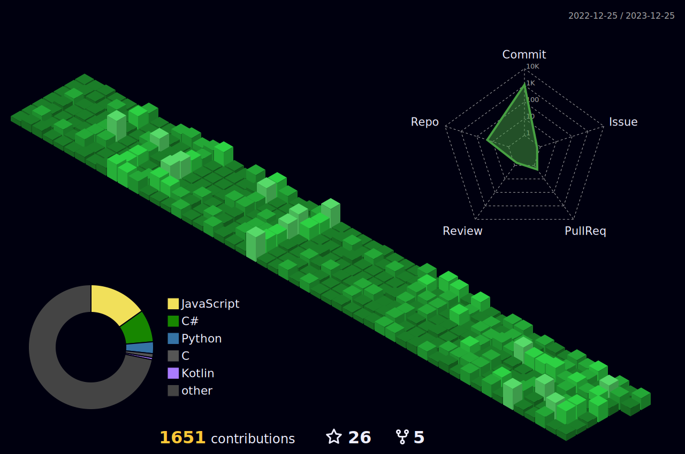

  

  <!-- Typing SVG by DenverCoder1 - https://github.com/DenverCoder1/readme-typing-svg -->

	

## 🛠️ My Favorite Tools

<h3>👨‍💻 Programming and Markup Languages</h3>

<h3>🧰 Frameworks and Libraries</h3>

<h3>🎮 Game Development</h3>

<h3>🗄️ Databases and Cloud Hosting</h3>

<h3>🖥️ Software and Tools</h3>

## 📊 Stats and Activity

  <h3>🔥 Streak Stats</h3>

  <!-- GitHub Readme Streak Stats - https://github.com/DenverCoder1/github-readme-streak-stats -->
  

    
  

  <h3>💻 GitHub Profile Stats</h3>

  <!-- https://github.com/anuraghazra/github-readme-stats -->

 

<b>Note:</b> This does not represent skill level but purely the amount of code in each language on my profile.

  <!-- https://github.com/ashutosh00710/github-readme-activity-graph -->

<!--
## 🖥️ Contributions
<h4 align="center">Isometric view of contributions in the last year</h4>

	

-->

### 🤡 Bored? Here's a joke:

  

